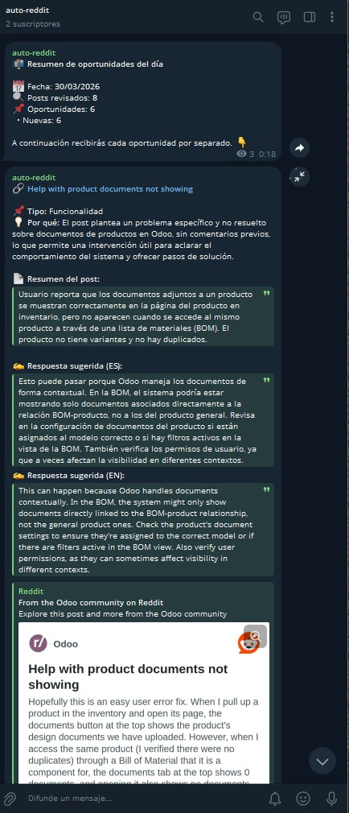

<p align="center">
  
</p>

# auto-reddit

## Descripcion general del proyecto

auto-reddit es un sistema de deteccion diaria de oportunidades de participacion en Reddit para equipos de marketing y contenido que trabajan con Odoo.

El producto resuelve un problema operativo concreto: seguir manualmente Reddit para detectar posts donde una empresa con experiencia en Odoo puede aportar valor es costoso en tiempo y dificil de sistematizar. auto-reddit automatiza esa vigilancia y entrega cada dia un conjunto de oportunidades filtradas y evaluadas, directamente en Telegram, con el contexto suficiente para que un humano decida si intervenir.

El principio rector del producto es claro: **la IA propone, el humano decide y publica**. El sistema nunca publica en Reddit de forma autonoma. Su unica funcion es reducir el trabajo de deteccion y preparacion, dejando el criterio y la accion final siempre en manos del equipo.

El usuario principal es el equipo de marketing y contenido. La fuente de datos del primer slice es `r/Odoo`.

La referencia operativa vigente para la integracion con Reddit es `docs/integrations/reddit/api-strategy.md`.

Mapa completo de documentacion para maintainers: [`docs/README.md`](docs/README.md).

---

## Stack tecnologico

| Componente | Tecnologia |
|---|---|
| Lenguaje | Python 3.14 |
| Gestor de dependencias | uv |
| Despliegue | Docker en VPS (contenedor efimero + cron externo) |
| Persistencia | SQLite (fichero en volumen Docker) |
| Contratos internos | Pydantic |
| Configuracion y secretos | pydantic-settings + `.env` |
| Evaluacion IA | DeepSeek via SDK de OpenAI |
| Notificaciones | Telegram Bot API |
| Fuente de datos | RapidAPI (reddit3, reddit34, reddapi, reddit-com) |
| CI | GitHub Actions |

El modelo operativo es un contenedor efimero: arranca, ejecuta el proceso diario completo y muere. No hay proceso persistente corriendo en segundo plano. El cron externo en el VPS se encarga de la planificacion.

---

## Instalacion y ejecucion

### Dependencias

```bash
uv sync --extra dev
```

### Configuracion

Copiar el fichero de ejemplo y rellenar las 4 variables obligatorias:

```bash
cp .env.example .env
```

Variables obligatorias en `.env`:

| Variable | Descripcion |
|---|---|
| `DEEPSEEK_API_KEY` | API key de DeepSeek para evaluacion IA |
| `TELEGRAM_BOT_TOKEN` | Token del bot de Telegram para notificaciones |
| `TELEGRAM_CHAT_ID` | ID del chat donde se envian las notificaciones |
| `REDDIT_API_KEY` | API key de RapidAPI para acceso a Reddit |

Variables opcionales (con defaults):

| Variable | Default | Descripcion |
|---|---|---|
| `REVIEW_WINDOW_DAYS` | `7` | Ventana de busqueda en dias |
| `DAILY_REVIEW_LIMIT` | `8` | Maximo de candidatos a revisar por ejecucion |
| `MAX_DAILY_OPPORTUNITIES` | `8` | Maximo de oportunidades a entregar por dia |
| `DB_PATH` | `auto_reddit.db` | Ruta al fichero SQLite |
| `DEEPSEEK_MODEL` | `deepseek-chat` | Modelo de DeepSeek a usar |

### Ejecucion de tests

```bash
uv run pytest tests/ -x --tb=short
```

### Despliegue en VPS

El modelo operativo es un **contenedor efimero**: arranca, ejecuta el pipeline completo y muere. No hay proceso persistente. Para que se ejecute diariamente, necesitas un cron externo en el VPS.

#### Paso 1 — Preparar el entorno

```bash
# Si el puerto 22 (SSH) está bloqueado, usar HTTPS:
git clone https://github.com/Prodelaya/auto-reddit.git
cd auto-reddit
cp .env.example .env
# Editar .env y rellenar las 4 variables obligatorias:
# DEEPSEEK_API_KEY, TELEGRAM_BOT_TOKEN, TELEGRAM_CHAT_ID, REDDIT_API_KEY
```

#### Paso 2 — Instalar Docker (si no está instalado)

```bash
sudo apt install -y docker.io docker-compose-v2
```

#### Paso 3 — Construir y verificar

```bash
sudo docker compose up --build
```

El contenedor arranca, ejecuta el pipeline completo y termina. Si termina con `exited with code 0` y los mensajes llegan a Telegram, el despliegue es correcto. En fin de semana el pipeline se omite automaticamente (guard en `main.py`, no en el cron).

#### Paso 4 — Configurar el cron

La ejecucion diaria la controla un cron externo del servidor, no el contenedor:

```bash
sudo crontab -e
```

Anadir (ejemplo para las 10:30 hora del servidor):

```
30 10 * * * cd /opt/auto-reddit && docker compose up >> /var/log/auto-reddit.log 2>&1
```

El guard de fin de semana esta en el codigo (`main.py`), no en el cron, asi que la entrada puede correr los 7 dias sin problema: el script decide por si solo si ejecutar o no.

La guia de despliegue completa esta en [`docs/deployment.md`](docs/deployment.md).

#### Ver logs

```bash
# Logs de la ultima ejecucion
cat /var/log/auto-reddit.log

# O ver los logs del ultimo contenedor
docker compose logs auto-reddit
```

#### Persistencia

La base de datos SQLite vive en un volumen Docker (`sqlite_data:/data`). Los datos persisten entre ejecuciones del contenedor sin intervencion manual. Verificar con:

```bash
docker volume ls
```

## Acceso al despliegue operativo

Este proyecto no expone una interfaz web publica. El sistema corre en un VPS y su salida operativa real se entrega en Telegram, que es el canal donde el equipo consulta cada ejecucion diaria y revisa las oportunidades detectadas.

Ademas, el repositorio incluye una presentacion HTML del proyecto en `TFM/presentacion.html`.
Se puede abrir localmente directamente desde ese fichero en cualquier navegador.
Cuando quede desplegada con GitHub Pages, su URL esperada sera:

https://prodelaya.github.io/auto-reddit/TFM/presentacion.html

Canal operativo real:

https://t.me/+wp1xd6Rgik9lNWQ0

Referencia visual del canal en produccion:



---

## Estructura del proyecto

```
auto-reddit/
├── assets/
│   └── auto-reddit-logo.png
├── src/
│   └── auto_reddit/
│       ├── __init__.py
│       ├── main.py                    # orquestador del proceso diario
│       ├── reddit/                    # extraccion de candidatos y contexto
│       │   ├── __init__.py
│       │   ├── _constants.py          # categorias, idiomas, constantes del modulo
│       │   ├── client.py              # cliente HTTP para Reddit API
│       │   └── comments.py            # recuperacion de comentarios de hilo
│       ├── evaluation/                # evaluacion IA con DeepSeek
│       │   ├── __init__.py
│       │   └── evaluator.py           # logica de evaluacion y resumen
│       ├── delivery/                  # entrega por Telegram
│       │   ├── __init__.py
│       │   ├── renderer.py            # renderizado de mensajes para Telegram
│       │   ├── selector.py            # seleccion y priorizacion de candidatos
│       │   └── telegram.py            # envio via Telegram Bot API
│       ├── persistence/               # memoria operativa SQLite
│       │   ├── __init__.py
│       │   └── store.py               # CRUD de posts y estado de entrega
│       ├── shared/                    # contratos Pydantic compartidos
│       │   ├── __init__.py
│       │   └── contracts.py           # modelos Post, Candidate, Opportunity
│       └── config/                    # settings con pydantic-settings
│           ├── __init__.py
│           └── settings.py            # carga y validacion de variables de entorno
├── tests/
│   ├── __init__.py
│   ├── conftest.py                    # fixtures compartidos
│   ├── test_main.py                   # test del orquestador principal
│   ├── test_import_smoke.py           # smoke test de imports
│   ├── test_ci_workflow.py            # validacion de workflow CI
│   ├── test_infra_hardening.py        # hardening de infraestructura
│   ├── test_settings_govern_runtime.py # settings gobiernan el runtime
│   ├── test_reddit/
│   │   ├── __init__.py
│   │   ├── conftest.py                # fixtures especificos de Reddit
│   │   ├── test_client.py
│   │   └── test_comments.py
│   ├── test_evaluation/
│   │   ├── __init__.py
│   │   ├── test_contracts.py
│   │   └── test_evaluator.py
│   ├── test_delivery/
│   │   ├── __init__.py
│   │   ├── test_deliver_daily.py
│   │   ├── test_renderer.py
│   │   ├── test_selector.py
│   │   └── test_telegram.py
│   ├── test_persistence/
│   │   ├── __init__.py
│   │   └── test_store.py
│   └── test_integration/
│       ├── __init__.py
│       └── test_operational.py        # tests de integracion operacional
├── scripts/
│   ├── README.md
│   └── reddit_api_raw_snapshot.py     # snapshot crudo de Reddit API para debugging
├── skills/
│   ├── deepseek-integration/          # skill: integracion con DeepSeek
│   ├── docker-deployment/             # skill: despliegue Docker
│   └── python-conventions/            # skill: convenciones de codigo Python
├── .github/
│   └── workflows/
│       └── ci.yml                     # pipeline CI: pytest en cada push y PR
├── docs/
│   ├── architecture.md               # decisiones arquitectonicas
│   ├── operations.md                  # guia operativa
│   ├── integrations/
│   │   └── reddit/
│   │       ├── comparison.md          # comparativa de APIs evaluadas
│   │       └── api-strategy.md        # estrategia vigente de seleccion y fallback
│   ├── product/
│   │   ├── product.md                 # fuente de verdad del producto
│   │   └── ai-style.md                # comportamiento y estilo de la IA
│   └── discovery/                     # documentacion historica de ideacion
├── openspec/                          # planning SDD por changes
├── TFM/                               # documentacion academica del proyecto
├── pyproject.toml
├── Dockerfile
├── docker-compose.yml
├── .env.example
└── README.md
```

---

## Funcionalidades principales

- **Deteccion diaria de oportunidades en `r/Odoo`**: cada dia el sistema recoge todos los posts de `r/Odoo` dentro de una ventana configurable (`review_window_days`), los normaliza para el pipeline interno y revisa como maximo `daily_review_limit` candidatos elegibles priorizados por recencia. El numero maximo de oportunidades entregadas por dia esta gobernado por `max_daily_opportunities`.
- **Filtrado por categorias de oportunidad**: los posts se clasifican en una taxonomia cerrada: funcionalidad y configuracion de Odoo, desarrollo, dudas sobre si merece la pena Odoo, y comparativas con otras opciones.
- **Evaluacion por IA**: DeepSeek evalua cada candidato para decidir si representa una oportunidad valida, resume el contexto en espanol para el equipo interno e incluye una respuesta sugerida en espanol y otra en ingles para revision humana.
- **Entrega diaria por Telegram**: el equipo recibe un mensaje de resumen con la fecha, el numero de posts revisados y el numero de oportunidades detectadas, seguido de un mensaje por cada oportunidad con titulo, enlace, idioma del post, tipo, resumen y respuesta sugerida.
- **Contexto del hilo bajo demanda**: los comentarios se recuperan solo para los posts seleccionados por el selector para el flujo posterior; no forman parte de la recoleccion inicial de candidatos. Esto esta implementado en `delivery/selector.py` y `reddit/comments.py`.
- **Control de duplicados e idempotencia**: cada post se registra y se envia una sola vez. No existe backlog explicito ni estado `approved`; `rejected` es descarte final de negocio, `not selected today` no es un estado persistente, y si Telegram falla tras una aceptacion de IA se reintenta el envio sin reevaluar.

---

## Tests y CI

El proyecto tiene **396 tests pasando y 4 skipped** (smoke tests live sin credenciales).

- **Tests unitarios**: cada modulo tiene su suite correspondiente en `tests/test_<modulo>/`.
- **Tests de integracion operacional**: `tests/test_integration/test_operational.py` cubre el flujo end-to-end del proceso diario.
- **Smoke tests**: `tests/test_import_smoke.py` valida imports, `test_ci_workflow.py` y `test_infra_hardening.py` validan configuracion de CI e infraestructura.
- **Settings govern runtime**: `tests/test_settings_govern_runtime.py` verifica que los settings reales (`review_window_days`, `daily_review_limit`, `max_daily_opportunities`) gobiernan el comportamiento del runtime.

CI con GitHub Actions ejecuta `uv run pytest tests/ -x --tb=short` en cada push y PR a `main`.
